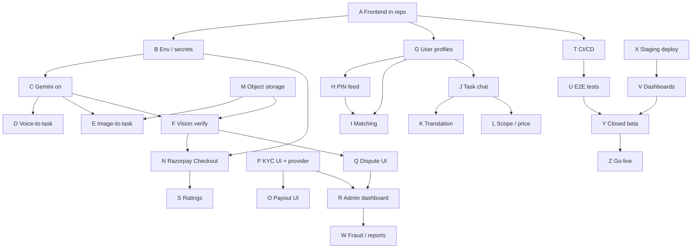

# Marketplace & Product — Next Phases Plan (A–Z)

This plan covers **what to build next** after the agentic chatbot backend (Phases A–Z in `agentic_chatbot_implementation_checklist.md`, all complete) and the initial FastAPI marketplace APIs.

**Audience:** engineers and PMs planning the path from “demo-ready backend + UI” to **closed beta in India**.

**How to use this doc**

- Work phases **in order** where dependencies apply; parallel tracks are called out.
- Mark items `[x]` as you ship; keep `[ ]` for remaining work.
- Each phase ends with a **Definition of Done (DoD)** you can demo in staging.

---

## Current baseline (already shipped)

| Area | Status |
|------|--------|
| FastAPI backend (auth, tasks, escrow, disputes API, KYC API, agent chat, Razorpay webhooks) | Done |
| Docker local / staging / prod + README runbooks | Done |
| Next.js UI (`frontend_nextjs/`) — landing, poster, tasker, chat, verify, payments | Built, **Phase A integrated** |
| Real AI (voice, vision, matching, Bhashini) | Mostly **stub / rule-based** |
| Poster ↔ tasker chat, profiles, admin UI, mobile, CI/CD, E2E | **Not started** |

---

## Recommended delivery waves

| Wave | Phases | Goal |
|------|--------|------|
| **Wave 1 — Ship the web MVP** | A → H | Committed frontend, real config, profiles, PIN feed |
| **Wave 2 — Trust & money UX** | I → P | Matching, peer chat, uploads, Razorpay Checkout, KYC UI |
| **Wave 3 — Ops & quality** | Q → V | Disputes/admin UI, ratings, CI/CD, E2E, dashboards |
| **Wave 4 — Launch** | W → Z | Fraud rules, staging deploy, beta, production signoff |

---

## Phase A — Frontend integration & repository hygiene

**Goal:** Treat the Next.js app as a first-class part of the repo and runnable by any developer.

- [x] Add `frontend_nextjs/` to git with `.env.local.example` (`NEXT_PUBLIC_API_BASE`, `NEXT_PUBLIC_WS_BASE`).
- [x] Document `npm install && npm run dev` in root `README.md` (proxy or direct API URL).
- [x] Add root-level `package.json` scripts or `Makefile` targets: `dev-backend`, `dev-frontend`, `dev-all`.
- [x] Align branding (VayuTask vs airtasker) in env and docs.
- [x] Add `frontend_nextjs` to `.gitignore` exclusions only for `.env.local`, `node_modules`, `.next`.

**DoD:** Clone → `docker compose up` + `npm run dev` → login works against local API.

**Depends on:** nothing.

---

## Phase B — Environment, secrets, and feature flags

**Goal:** One clear matrix for dev / staging / prod; no accidental mock mode in staging.

- [ ] Copy `backend_fastapi/.env.example` → document every flag (`USE_MOCK_CHATBOT`, `KYC_STUB_AUTO_VERIFY`, Razorpay, Gemini, Pinecone, Redis).
- [ ] Staging env file template (no real PAN/Aadhaar in logs; webhook secrets required).
- [ ] Frontend env validation on boot (warn if `NEXT_PUBLIC_API_BASE` missing).
- [ ] Document “production minimum secrets” checklist (link README go-live section).

**DoD:** Staging `.env` checklist reviewed; app refuses unsafe Razorpay webhook config outside dev.

**Depends on:** Phase A.

---

## Phase C — Turn on real Gemini (chatbot + drafts)

**Goal:** Replace rule-based defaults with Gemini where keys are set.

- [ ] Set `GEMINI_API_KEY`, `USE_MOCK_CHATBOT=false` in staging.
- [ ] Extend `create_task_draft` to call Gemini structured JSON (reuse `gemini_structured_service` / task schema validator).
- [ ] Add schema validation + retry on invalid JSON (max 2 retries, then clarifying question).
- [ ] Keep rule-based parser as fallback when Gemini unavailable.
- [ ] Add integration test fixture: mock Gemini → valid `ai_schema`.

**DoD:** Poster submits Hindi text → draft JSON from Gemini with validated fields; chatbot uses Gemini synthesis in staging.

**Depends on:** Phase B.

**Parallel with:** Phase D, E.

---

## Phase D — Voice-to-task (real STT)

**Goal:** Audio from poster UI becomes transcript → task draft.

- [ ] Wire `POST /api/voice/transcribe` to Whisper **or** Google STT **or** Bhashini ASR (pick one for MVP).
- [ ] Poster page: upload recorded blob to transcribe endpoint before `POST /api/tasks/drafts`.
- [ ] Pass detected language into draft creation.
- [ ] Rate-limit voice endpoint; max file size config.

**DoD:** Record 10s clip → transcript → Gemini/rule draft → publish flow works end-to-end.

**Depends on:** Phase C (recommended), Phase A.

---

## Phase E — Image-to-task (vision draft)

**Goal:** Photo upload suggests category, description, tools, evidence needs.

- [ ] `POST /api/tasks/drafts/from-image` (multipart) → Gemini Pro Vision → task schema.
- [ ] Poster UI: image picker + preview + edit draft before publish.
- [ ] Store image in object storage (Phase M) or temporary signed URL for MVP.

**DoD:** Upload broken-AC photo → structured draft with category and description; poster can edit and publish.

**Depends on:** Phase C; Phase M for production storage.

---

## Phase F — Real vision verification (evidence)

**Goal:** Replace `_mock_verification_status` with Gemini Vision before/after analysis.

- [ ] `POST /api/tasks/{id}/verify` calls vision model with before/after URLs (and optional video frame).
- [ ] Return confidence, status (`PASS` / `LOW_CONFIDENCE` / `FAIL`), explanation JSON.
- [ ] Auto-open dispute on `FAIL` or `LOW_CONFIDENCE` per config threshold.
- [ ] Auto-set escrow `RELEASE_ELIGIBLE` on high-confidence `PASS`.
- [ ] Admin override endpoint preserved.

**DoD:** Verify page shows real model confidence; release escrow only after PASS or admin resolve.

**Depends on:** Phase M (URLs must be reachable by model), Phase C.

---

## Phase G — User profiles (tasker & poster)

**Goal:** Support matching, PIN areas, and language preferences.

- [ ] Alembic migration: `user_profiles` (`user_id`, `display_name`, `skills[]`, `service_pin_codes[]`, `preferred_languages[]`, `bio`, `avatar_url`).
- [ ] `GET/PUT /api/users/me/profile` (auth).
- [ ] Tasker onboarding UI: skills, PINs, languages.
- [ ] Poster optional profile (default location PIN).

**DoD:** Tasker saves profile; data returned on `GET /api/users/me/profile`.

**Depends on:** Phase A.

---

## Phase H — Location & feed filtering (PIN)

**Goal:** Tasker radar shows geographically relevant tasks.

- [ ] Add `location_pin` (and optional `landmark`) to task schema at publish time.
- [ ] `GET /api/tasks/feed?pin=110001&radius_km=` filter (start with exact PIN prefix or same PIN; expand later).
- [ ] Tasker UI: PIN filter wired to API (remove mock-only fallback when API up).
- [ ] Validate PIN format (6-digit India).

**DoD:** Two tasks in different PINs; tasker filter shows only matching region.

**Depends on:** Phase G.

---

## Phase I — AI matchmaking (embeddings)

**Goal:** Personalized task feed for taskers, not just category filter.

- [ ] On publish: embed task title + description (reuse embeddings provider).
- [ ] On profile update: embed tasker skills bio.
- [ ] `GET /api/tasks/feed/recommended` — vector similarity + PIN filter + category.
- [ ] Use pgvector **or** Pinecone namespace `task-matching` (reuse existing Pinecone setup).
- [ ] Fallback: recency + category if vectors unavailable.

**DoD:** Tasker with “plumbing” skills sees plumbing tasks ranked higher than unrelated categories.

**Depends on:** Phase G, H; Pinecone optional.

---

## Phase J — Poster ↔ tasker task chat

**Goal:** Per-task messaging separate from the agent chatbot.

- [ ] Models: `task_chat_sessions` (task_id, poster_id, tasker_id), `task_chat_messages` (original_text, translated_text, source_lang, target_lang).
- [ ] `GET/POST /api/tasks/{id}/chat/messages` (participants only).
- [ ] WebSocket channel `/api/tasks/{id}/chat/ws` or reuse notification infra.
- [ ] Frontend: chat thread on task detail (not `/chat` agent page).

**DoD:** Poster sends Hindi; tasker sees English translation; messages persisted.

**Depends on:** Phase K for real translation; stub OK for first slice.

---

## Phase K — Production translation bridge

**Goal:** Reliable cross-language chat (Bhashini or Gemini).

- [ ] Choose MVP provider: Bhashini API **or** Gemini translate (already partial).
- [ ] Replace `stub_translate` in task chat path.
- [ ] Language detection on message (`source_lang=auto`).
- [ ] Config: supported beta languages (e.g. en, hi, ta).

**DoD:** Task chat translations verified for 2+ language pairs in staging.

**Depends on:** Phase J; Phase B.

---

## Phase L — Scope negotiation & price snapshot

**Goal:** Record agreed scope before escrow to reduce disputes.

- [ ] Table `task_scopes` (task_id, agreed_price, currency, scope_json, agreed_at, poster_id, tasker_id).
- [ ] `POST /api/tasks/{id}/scope/propose` / `accept` (both parties).
- [ ] Optional: agent tool “suggest fair range” using historical tasks (later).
- [ ] Escrow amount defaults from agreed price.

**DoD:** After accept, parties agree price → escrow start uses agreed amount.

**Depends on:** Phase J or accept flow; payments API.

---

## Phase M — Object storage for media

**Goal:** Stop relying on arbitrary external URLs for evidence and uploads.

- [ ] S3-compatible bucket (AWS / MinIO for local).
- [ ] `POST /api/uploads/presign` → client PUT → store key on evidence row.
- [ ] Update evidence + image-to-task + KYC doc upload to use keys.
- [ ] Access control: only task parties + admin read evidence.

**DoD:** Upload before/after from UI; URLs are your bucket; vision model can fetch them.

**Depends on:** Phase B; blocks production Phase E/F.

---

## Phase N — Razorpay Checkout UX

**Goal:** Poster actually pays, not only “order created” in ledger.

- [ ] Embed Razorpay Checkout.js on `/payments` with `order_id` + `key_id` from API.
- [ ] Handle success/failure callbacks; poll or webhook-driven UI state.
- [ ] Show escrow status from API (`GET /api/tasks/{id}/escrow` if needed).
- [ ] Test with Razorpay test mode in staging.

**DoD:** Test card payment → webhook → escrow `PAYMENT_CAPTURED` reflected in UI.

**Depends on:** Phase B (Razorpay keys); backend already has order + webhooks.

---

## Phase O — Tasker payout onboarding UI

**Goal:** Taskers register bank details for RazorpayX payout.

- [ ] UI: `POST /api/payments/razorpay/payout/register-bank` form (IFSC, account, name).
- [ ] Show payout status on task completion (`payout_status`, `razorpay_payout_id`).
- [ ] Respect `KYC_REQUIRED_FOR_PAYOUT` with clear UX when blocked.

**DoD:** Verified tasker registers bank → after release, payout status visible.

**Depends on:** Phase P if KYC gate enabled; Phase N for full money flow.

---

## Phase P — KYC product flows + real provider

**Goal:** Move from stub KYC to partner-ready verification.

- [ ] Frontend: submit PAN/Aadhaar last4 + name (`POST /api/kyc/submit`).
- [ ] Admin UI: pending queue (`GET /api/kyc/admin/pending`, review action).
- [ ] Implement `SignzyKycProvider` or `DigiLockerKycProvider` adapter (one partner for beta).
- [ ] Turn off `KYC_STUB_AUTO_VERIFY` in staging; test webhook `POST /api/webhooks/kyc`.
- [ ] Enable `KYC_REQUIRED_FOR_PAYOUT=true` in staging when ready.

**DoD:** New tasker submits KYC → admin approves → payout registration succeeds.

**Depends on:** Phase A, O; backend APIs exist.

---

## Phase Q — Dispute UI

**Goal:** Users and admins can run dispute lifecycle without curl.

- [ ] Poster/tasker: open dispute (`POST /api/tasks/{id}/disputes`) with reason + notes.
- [ ] Show dispute status on payments/verify pages.
- [ ] Admin: resolve (`POST /api/tasks/disputes/{id}/resolve`) with release/refund outcome.
- [ ] Link to refund/payout metrics in admin view.

**DoD:** Low-confidence verify → dispute opened → admin resolves → escrow terminal state correct.

**Depends on:** Phase F, N; backend exists.

---

## Phase R — Admin / reviewer dashboard

**Goal:** One place for ops: KYC, disputes, low-confidence verifications.

- [ ] Route `/admin` (role `ADMIN` / `REVIEWER` only).
- [ ] Queues: pending KYC, open disputes, low-confidence verifications.
- [ ] Read-only task schema + evidence thumbnails + chat summary (optional).
- [ ] Audit log viewer (`audit_logs` recent entries).

**DoD:** Reviewer resolves a dispute and approves KYC without using API client.

**Depends on:** Phase P, Q, F.

---

## Phase S — Ratings & reviews

**Goal:** Post-completion trust loop.

- [ ] Table `task_ratings` (task_id, rater_id, ratee_id, score 1–5, comment).
- [ ] `POST /api/tasks/{id}/rate` after `COMPLETED` / escrow released.
- [ ] Show average on tasker profile.

**DoD:** Poster rates tasker after release; rating visible on profile.

**Depends on:** Escrow release flow (Phase N, F).

---

## Phase T — CI/CD pipeline

**Goal:** Every PR runs lint and tests; main deploys to staging.

- [ ] GitHub Actions: backend `pytest`, alembic check, ruff/black (if adopted).
- [ ] Frontend: `npm run lint`, `npm run build`.
- [ ] Optional: `docker compose -f docker-compose.yml -f docker-compose.staging.yml build` on main.
- [ ] Secret scanning; block `.env` commits.

**DoD:** PR checks green; README badge or doc link to workflow.

**Depends on:** Phase A (frontend in repo).

---

## Phase U — End-to-end test suite

**Goal:** Automate happy path and dispute path.

- [ ] Playwright or Cypress: register → draft → publish → accept → escrow → evidence → verify → release.
- [ ] Dispute path: low confidence → dispute → admin resolve (test user seeds).
- [ ] CI job `RUN_INTEGRATION_TESTS=1` against docker-compose Postgres.
- [ ] Razorpay webhook tests remain in pytest; E2E uses test mode or mocks.

**DoD:** E2E runs in CI on schedule or main; documented local `npm run test:e2e`.

**Depends on:** Phase T, A, N.

---

## Phase V — Observability dashboards

**Goal:** Move from JSON metrics endpoints to visual ops.

- [ ] Export Prometheus metrics from FastAPI (requests, 5xx, webhook counts, queue depth).
- [ ] Grafana dashboards: API health, payments, notifications, KYC.
- [ ] Wire README alert thresholds to dashboard panels.
- [ ] Optional: Sentry for frontend + backend errors.

**DoD:** Staging Grafana shows live traffic; on-call can use dashboard during deploy.

**Depends on:** Phase X deploy target.

---

## Phase W — Fraud, reporting, and trust heuristics

**Goal:** Starter safety beyond KYC and disputes.

- [ ] `POST /api/reports` (user, task, reason).
- [ ] Rules: repeated cancellations, evidence mismatch count, velocity limits on new accounts.
- [ ] Admin queue integration in Phase R.
- [ ] Document appeal flow (manual for beta).

**DoD:** Report submitted → appears in admin; one heuristic flags test account.

**Depends on:** Phase R.

---

## Phase X — Staging deployment & automated smoke

**Goal:** Always-on staging environment for demos and QA.

- [ ] Deploy API + Postgres (+ Redis profile) to VPS / cloud / Railway / Render.
- [ ] HTTPS reverse proxy; CORS locked to staging frontend origin.
- [ ] Post-deploy script: health, auth, one task flow, webhook test endpoint.
- [ ] Run README “Deploy smoke-test” checklist automatically where possible.

**DoD:** Public staging URL; team runs full flow without localhost.

**Depends on:** Phases A, B, T recommended.

---

## Phase Y — Closed beta (limited launch)

**Goal:** Real users in one city / PIN cluster, few categories.

- [ ] Pick 3 categories (e.g. electrical, plumbing, cleaning).
- [ ] Pick 2–3 languages for support.
- [ ] Feature flags: disable unfinished modules.
- [ ] Support playbook + feedback form.
- [ ] Monitor KPIs: time-to-publish, accept rate, dispute rate, AI cost per task.

**DoD:** 10+ real tasks completed in staging/production beta with measured KPIs.

**Depends on:** Waves 1–3 substantially complete (through Phase R minimum).

---

## Phase Z — Production go-live signoff

**Goal:** Controlled production launch using existing README runbooks.

- [ ] Complete go-live checklist in `README.md` (env, migrations, backup, smoke).
- [ ] Fill go-live signoff template (owner, version, rollback owner).
- [ ] Change freeze + stakeholder comms.
- [ ] First 60 minutes monitoring (error rate, webhooks, payout failures).
- [ ] Rollback drill documented and tested once on staging.

**DoD:** Signed signoff doc; production healthy 24h; rollback path proven.

**Depends on:** Phase X, Y learnings; all critical secrets rotated for prod.

---

## Dependency overview

---

## Suggested 12-week roadmap (indicative)

| Weeks | Focus | Phases |
|-------|--------|--------|
| 1–2 | Repo + config + Gemini + profiles + PIN | A, B, C, G, H |
| 3–4 | Media + real AI inputs + verification | M, D, E, F |
| 5–6 | Money UX + peer chat | N, O, J, K, L |
| 7–8 | Trust surfaces | P, Q, R |
| 9 | Quality | S, T, U |
| 10 | Ops | V, W, X |
| 11–12 | Beta + launch | Y, Z |

Adjust based on team size; Phases D/E/F can parallelize after C+M.

---

## Acceptance criteria (product-level)

Aligned with `agentic_chatbot_implementation_checklist.md` acceptance criteria, plus marketplace:

- [ ] Poster can publish via **voice or text** with valid structured schema (Gemini-validated).
- [ ] Tasker sees **relevant** tasks by PIN and skills.
- [ ] Poster and tasker chat in **different languages** with stored translations.
- [ ] Poster pays via **Razorpay Checkout**; escrow state matches webhooks.
- [ ] Evidence verification uses **vision model**; low confidence routes to admin/dispute.
- [ ] Tasker receives **payout** after release (KYC gate if enabled).
- [ ] Admin can resolve **KYC** and **disputes** without raw API calls.
- [ ] CI runs **tests + E2E** on every merge to main.
- [ ] Staging environment passes **deploy smoke** before production signoff.

---

## Out of scope for this plan (future work)

- React Native / Expo mobile app (separate track after web beta stable).
- Auto-negotiator bot mediating price (post Phase L).
- UPI split payments beyond RazorpayX capabilities.
- Multi-region expansion outside India PIN model.

---

## Related documents

| Document | Purpose |
|----------|---------|
| `agentic_chatbot_implementation_checklist.md` | Completed agent/RAG/infra backend phases |
| `implementation_plan_india.md` | Original MVP scope and data model |
| `LOCAL_PROGRESS_SUMMARY.md` | Snapshot of completed backend work |
| `README.md` | Docker, runbooks, go-live checklists |

---

*Last updated: 2026-05-24 — create issues/tasks from unchecked boxes per phase.*
